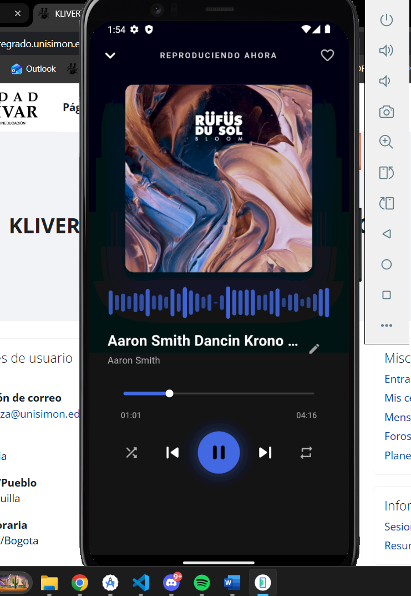
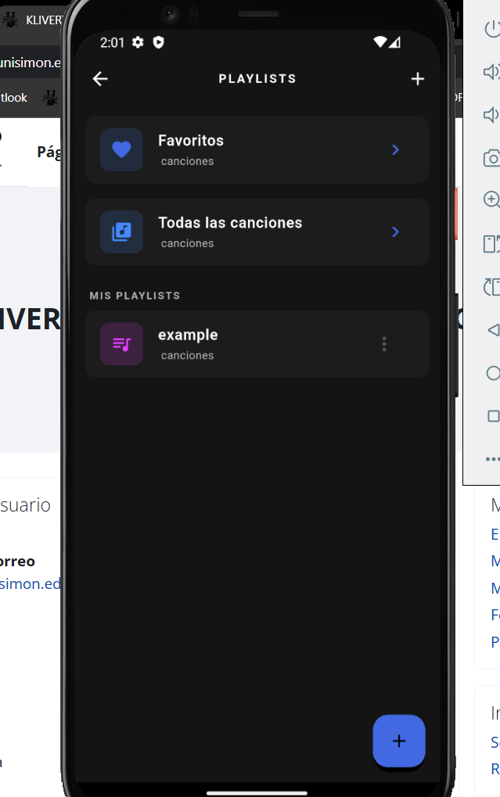
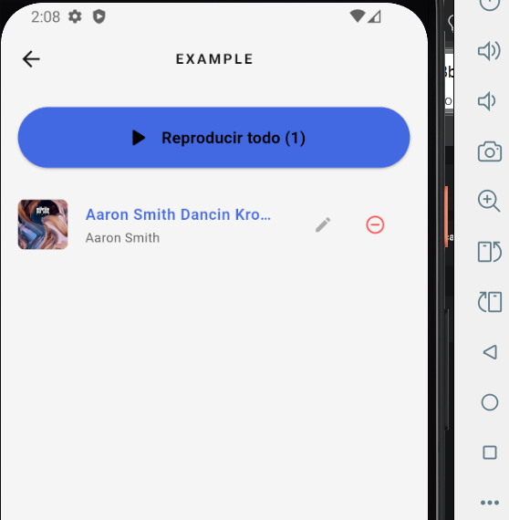
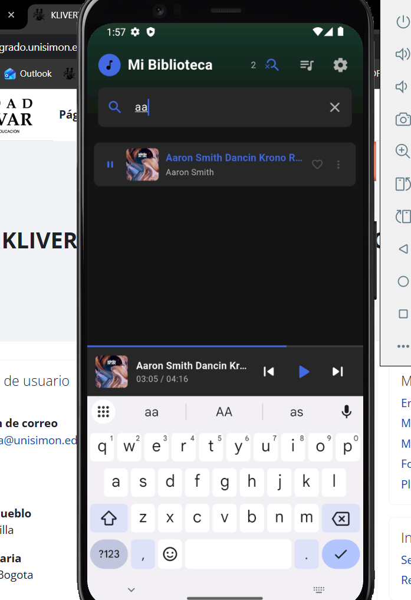
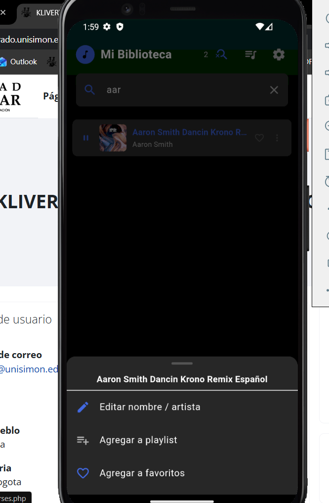
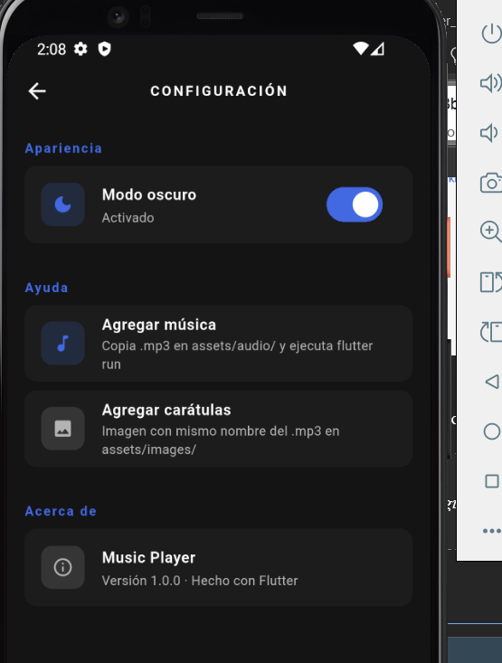

# 🎵 Flutter Music Player

A modern and fully functional music player app built with Flutter, inspired by professional streaming platforms.

---

## 🚀 Features

* 🎧 Play local audio files (mp3, wav, aac, ogg, m4a)
* ⏯️ Playback controls (play, pause, next, previous)
* 🔀 Shuffle and repeat modes
* ❤️ Favorites system
* 📁 Custom playlists
* 🔍 Real-time search
* 🌙 Light & Dark mode
* 🎨 Dynamic UI based on album colors
* 📊 Animated waveform visualizer

---

## 🧠 Technologies

* Flutter
* Dart
* Provider (State Management)
* Shared Preferences

---

## 📸 Screenshots

<p align="center">
  
  
  
</p>

<p align="center">
  
  
  
</p>
---

## ▶️ How to Run

```bash
flutter pub get
flutter run
```

---

## 📂 Assets

* Add music files to: `assets/audio/`
* Add images to: `assets/images/`

---

## 👨‍💻 Author

Klivert - Systems Engineering Student
